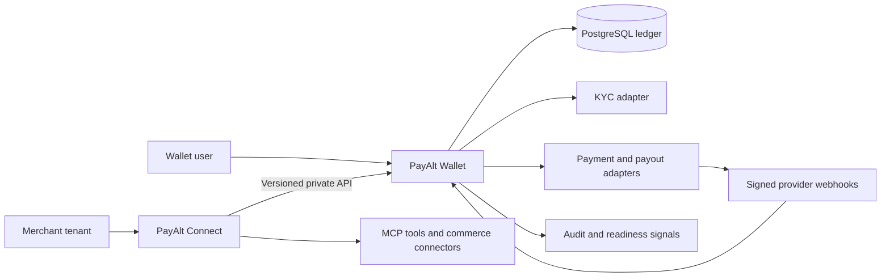

# PayAlt — Fintech Architecture Case Study

PayAlt is a technical sandbox for an authenticated e-wallet and a separate
multi-tenant commerce integration platform. This repository documents the
engineering decisions, safety invariants, validation strategy, and verified
sandbox results without publishing the proprietary implementation.

> Status: technical case study. PayAlt is not presented as a production-ready
> regulated financial service.

## Problem

Wallet products have to coordinate payment providers, an internal ledger,
identity controls, webhooks, payouts, and external integrations without
allowing browser redirects, duplicated events, or tenant connectors to mutate
money directly.

PayAlt explores a boundary in which:

- Wallet owns customer identity, balances, KYC state, and provider settlement;
- Connect owns tenant-scoped integrations, MCP tools, SDK/CLI surfaces, and
  approval-gated proposed actions;
- verified provider events, rather than browser success pages, settle funds;
- all monetary values use integer minor units;
- external connectors never receive direct ledger credentials.

## Architecture

## Core engineering decisions

### Ledger safety

- available and reserved balances are separate;
- settlement is atomic and idempotent;
- amount, currency, provider transaction, and local user are bound before
  crediting;
- withdrawals reserve funds before provider submission;
- only confirmed provider success can mark a payout as paid;
- terminal failure releases the reservation.

### Trust boundaries

- raw PAN and CVC never pass through the application backend;
- payout account data is encrypted and only a masked representation is exposed;
- Connect can read projections or submit proposed actions, but cannot update
  ledger rows;
- tenant scopes are checked at API and tool-contract boundaries;
- production readiness fails closed when mandatory dependencies are absent.

### Provider abstraction

The sandbox separates payment-domain state from provider-specific adapters.
Verified work includes Stripe pay-in flows and Tpay BLIK/card sandbox flows.
Other KYC and payout integrations remain adapters pending external account
activation and must not be described as production-complete.

## Verified sandbox evidence

- authenticated web wallet and role-gated administration;
- PostgreSQL ledger using integer minor units;
- idempotent webhook settlement;
- saved-card and 3DS recovery paths in a provider sandbox;
- successful BLIK pay-in through the Tpay sandbox: the transaction was created,
  Tpay delivered a signed notification, the backend validated its signature,
  merchant binding, amount, and currency, and the wallet credited the payment
  exactly once;
- KYC and payout adapter boundaries;
- tenant-scoped Connect contracts, MCP catalogue, SDK/CLI packages, and
  commerce adapter skeletons;
- automated lint, type checks, tests, production build, and Connect package
  compilation in the private source repository.

### Verified BLIK/Tpay flow

The BLIK sandbox result is significant because it validates the complete
technical settlement path rather than only a mocked screen or redirect:

1. the backend submitted a six-digit BLIK token to Tpay;
2. Tpay created the sandbox transaction;
3. Tpay delivered a signed server-to-server notification;
4. PayAlt verified the notification, transaction binding, amount, and currency;
5. the local transaction moved to `SUCCEEDED`;
6. the PostgreSQL ledger credited the wallet exactly once.

The BLIK token was not stored in transaction metadata or application logs.
This proves a working sandbox integration and idempotent settlement boundary.
It does not by itself prove production merchant activation, regulatory
readiness, or authorization to process real customer funds.

No customer data, credentials, provider identifiers, production configuration,
or proprietary source code are included here.

## Production blockers

Real customer funds must stay disabled until the product has:

1. an applicable licensing or regulated-partner model;
2. active KYC, AML, sanctions, and transaction-monitoring controls;
3. safeguarding or custody arrangements;
4. an externally verified payout rail;
5. stable webhook infrastructure, reconciliation, and alerting;
6. incident response, backup/restore, load testing, and independent security
   review.

## What this case study demonstrates

- domain-driven API and service boundaries;
- secure payment-provider integration;
- PostgreSQL transaction and ledger modelling;
- authentication and authorization;
- multi-tenant connector architecture;
- MCP and tool-contract design;
- approval-gated financial actions;
- testing and CI quality gates;
- explicit distinction between sandbox evidence and production readiness.

## Repository boundary

This public repository intentionally contains documentation only. The private
implementation, schemas, migrations, provider adapters, tests, deployment
configuration, and operational runbooks are excluded to protect product IP and
reduce security exposure.

## License

Documentation is provided for portfolio review. No license to use the
proprietary PayAlt implementation is granted.
